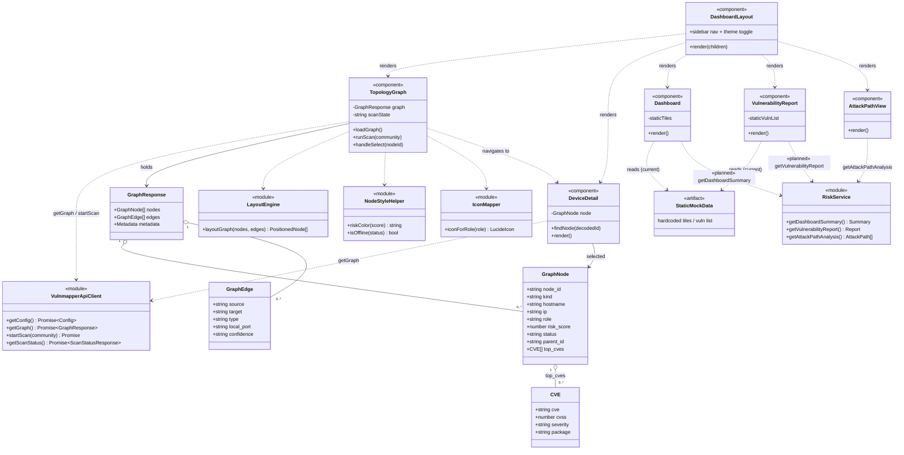
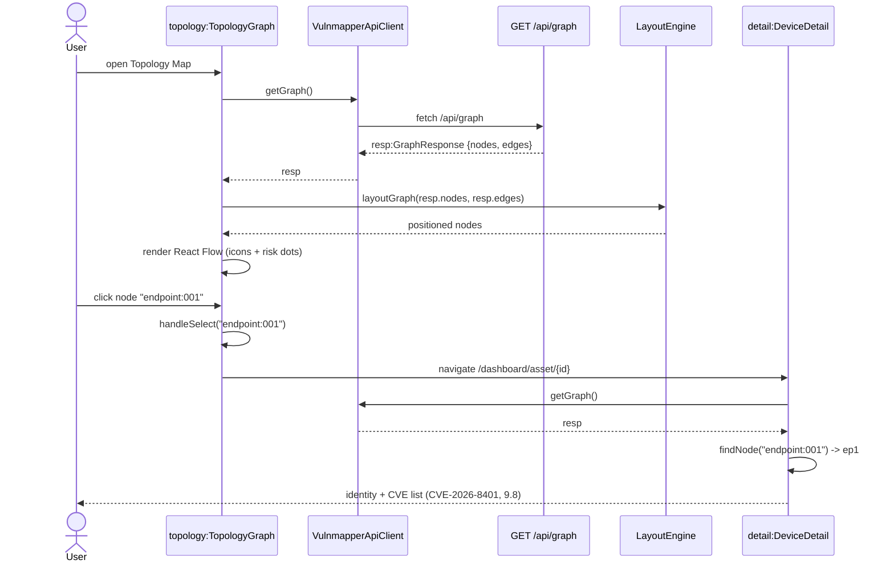
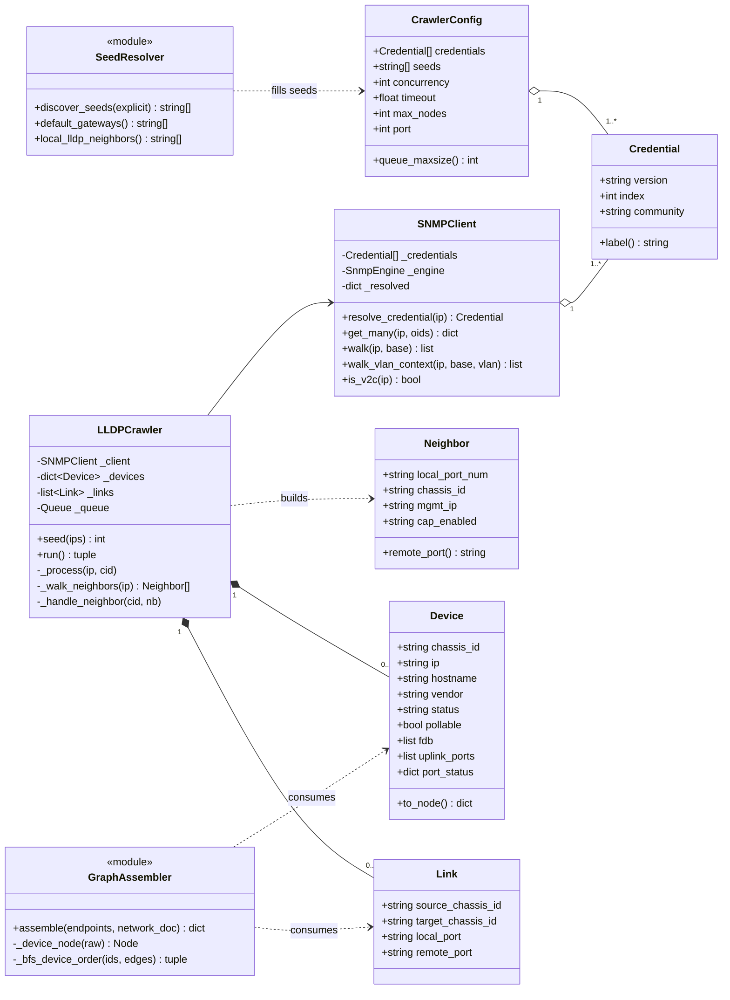
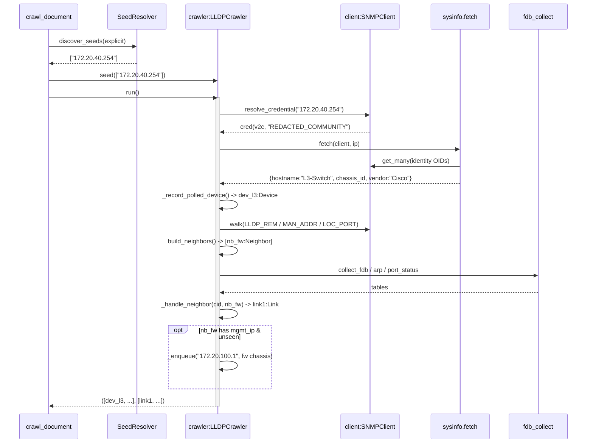
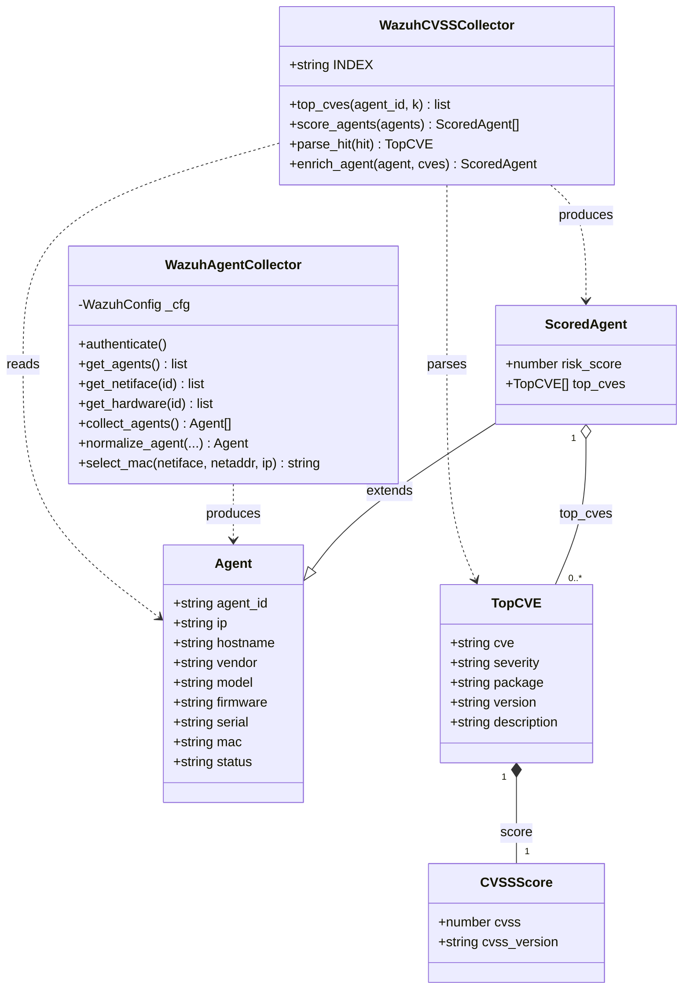
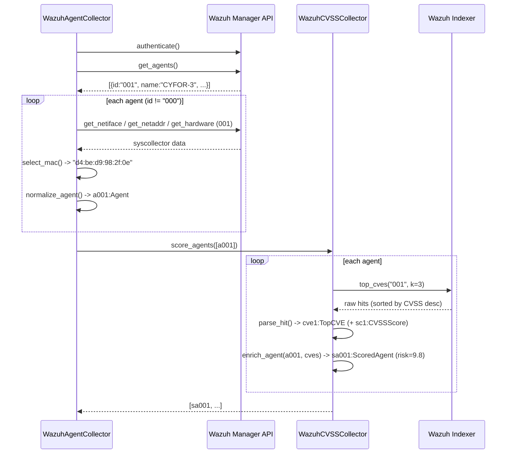
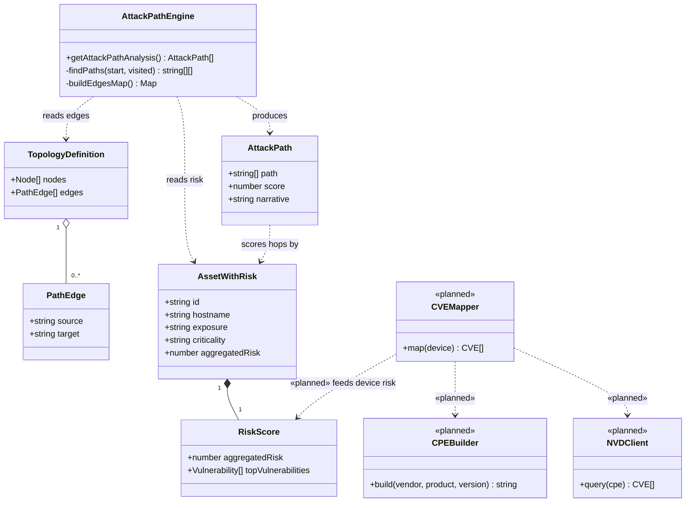
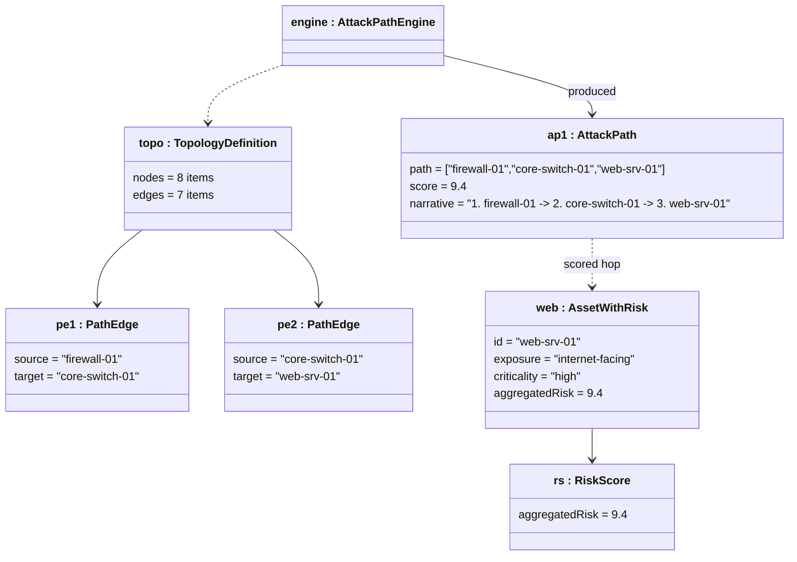
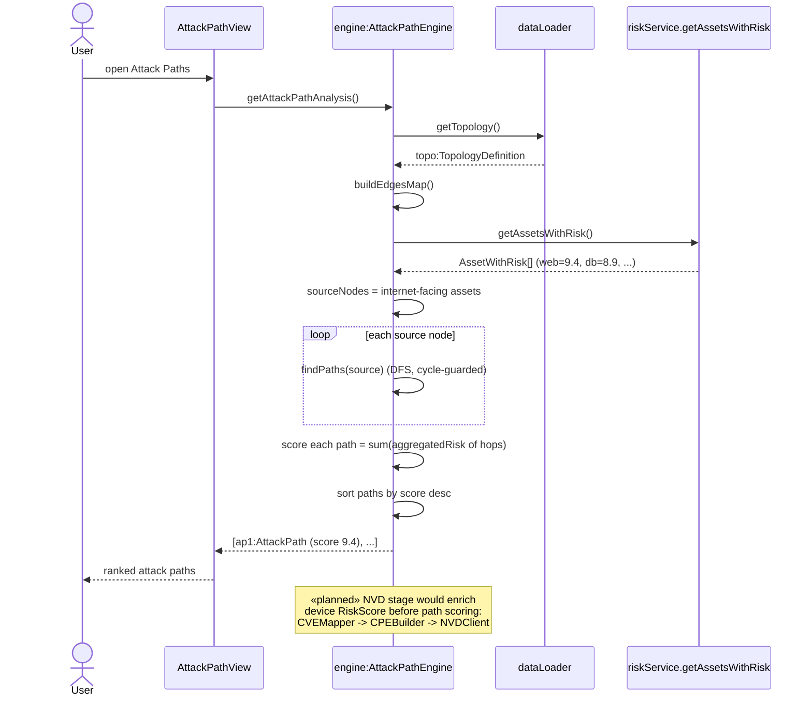

# UML Diagrams (Mermaid) — Class, Object & Sequence

Four diagram sets grouped by use case, then one complete class diagram with every
class. Each set contains: **class diagram → object diagram → sequence diagram**,
where the sequence diagram instantiates the same objects shown in the object
diagram. Every block is Mermaid — paste into GitHub, mermaid.live, or the VS Code
Mermaid preview.

> **Honesty note — how the requested names map to the code.** Some requested
> class names are conceptual; the code implements them as TypeScript
> components/types, Python classes, or normalized dicts produced by a module.
> Mappings are given under each set. Three classes in **Set 4**
> (`NVDClient`, `CPEBuilder`, `CVEMapper`) are **not implemented** in the current
> codebase — they represent the planned NVD enrichment stage that
> `assemble/merge.py` references in a comment ("Network nodes may not be
> CVE-scored yet — a separate NVD stage"). They are marked `«planned»` so the
> design intent is captured without pretending the code exists.

---

## SET 1 — GUI / Viewing Layer

**Use cases:** View Dashboard Overview, View Topology Map, View Device Detail,
View Vulnerability Report, View Attack Paths, Export Report.

**Name mapping (requested → actual code):**
| Requested | Actual code |
|---|---|
| `Dashboard` | `RiskDashboard.tsx` (static tiles) |
| `TopologyGraph` | `TopologyMap.tsx` + `PocTopologyView.tsx` + `layout.ts` |
| `DeviceDetail` | `AssetDetail.tsx` + `PocDeviceDetail.tsx` |
| `VulnerabilityReport` | `VulnerabilityReport.tsx` |
| `AttackPath` | `AttackPathAnalysis.tsx` |
| `GraphNode`/`GraphEdge` | types in `lib/vulnmapperApi.ts` |
| (supporting) | `VulnmapperApiClient` = `lib/vulnmapperApi.ts` |

### 1.1 Class diagram



> **Why Dashboard / VulnerabilityReport look separate:** they genuinely don't
> use the live graph today — they render `StaticMockData` (hardcoded arrays). The
> honest way to connect them to the rest of the diagram is through
> `DashboardLayout` (which renders every screen) and the `«planned»` links to
> `RiskService`, whose `getDashboardSummary()` / `getVulnerabilityReport()` were
> built to feed these screens but are currently bypassed. They are **not** wired
> to `VulnmapperApiClient`.

### 1.2 Object diagram (snapshot: Topology loaded, one node selected)

```mermaid
classDiagram
    class tg["topology : TopologyGraph"]
    tg : scanState = "idle"

    class resp["resp : GraphResponse"]
    resp : nodes = 3 items
    resp : edges = 1 item

    class n1["l3sw : GraphNode"]
    n1 : node_id = "device:00:23:ac:e5:74:00"
    n1 : kind = "device"
    n1 : hostname = "L3-Switch"
    n1 : role = "l3-switch"
    n1 : risk_score = 0
    n1 : status = "online"

    class n2["ep1 : GraphNode"]
    n2 : node_id = "endpoint:001"
    n2 : kind = "endpoint"
    n2 : hostname = "CYFOR-3"
    n2 : ip = "172.20.10.21"
    n2 : risk_score = 9.8
    n2 : status = "active"

    class cve1["cve1 : CVE"]
    cve1 : cve = "CVE-2026-8401"
    cve1 : cvss = 9.8
    cve1 : severity = "Critical"
    cve1 : package = "Mozilla Firefox"

    class e1["e1 : GraphEdge"]
    e1 : source = "endpoint:001"
    e1 : target = "device:00:23:ac:e5:74:00"
    e1 : type = "endpoint_link"
    e1 : confidence = "resolved"

    class dd["detail : DeviceDetail"]
    dd : node = ep1

    tg --> resp : graph
    resp --> n1
    resp --> n2
    resp --> e1
    n2 --> cve1 : top_cves[0]
    dd --> n2 : selected
```

### 1.3 Sequence diagram (View Topology Map → View Device Detail)



---

## SET 2 — Network Discovery Pipeline

**Use cases:** Run Network Discovery, Run New Scan.

**Name mapping:**
| Requested | Actual code |
|---|---|
| `SNMPClient` | `SnmpClient` (`network/snmp_client.py`) |
| `LLDPCrawler` | `Crawler` (`network/crawler.py`) |
| `Device` / `Link` | `network/models.py` |
| `CrawlerConfig` | `Config` (`network/config.py`) |
| `SeedResolver` | `seed` module (`network/seed.py`) |
| `GraphAssembler` | `assemble` (`assemble/merge.py`) |
| (supporting) | `Credential`, `Neighbor` |

### 2.1 Class diagram



### 2.2 Object diagram (snapshot: mid-crawl, seed switch polled)

```mermaid
classDiagram
    class cfg["cfg : CrawlerConfig"]
    cfg : seeds = ["172.20.40.254"]
    cfg : concurrency = 32
    cfg : max_nodes = 5000

    class cred["cred : Credential"]
    cred : version = "v2c"
    cred : index = 1
    cred : community = "REDACTED_COMMUNITY"

    class snmp["client : SNMPClient"]
    snmp : _resolved = {"172.20.40.254": cred}

    class crawler["crawler : LLDPCrawler"]
    crawler : _reserved = 2
    crawler : _seen = {l3, fw chassis}

    class dev1["dev_l3 : Device"]
    dev1 : chassis_id = "00:23:ac:e5:74:00"
    dev1 : ip = "172.20.40.254"
    dev1 : hostname = "L3-Switch"
    dev1 : vendor = "Cisco"
    dev1 : status = "online"
    dev1 : pollable = true

    class nb["nb_fw : Neighbor"]
    nb : chassis_id = "90:6c:ac:d7:43:7f"
    nb : mgmt_ip = "172.20.100.1"
    nb : local_port = "Fa1/0/1"

    class link1["link1 : Link"]
    link1 : source_chassis_id = "00:23:ac:e5:74:00"
    link1 : target_chassis_id = "90:6c:ac:d7:43:7f"
    link1 : local_port = "Fa1/0/1"

    cfg --> cred : credentials[0]
    snmp --> cred : _resolved value
    crawler --> snmp : _client
    crawler --> dev1 : _devices[chassis]
    crawler --> link1 : _links[0]
    crawler ..> nb : processing
```

### 2.3 Sequence diagram (Run Network Discovery on the seed device)



---

## SET 3 — Endpoint / Wazuh Pipeline

**Use case:** Collect Endpoint Data.

**Name mapping (these are dicts in code, modeled here as classes):**
| Requested | Actual code |
|---|---|
| `WazuhAgentCollector` | `WazuhClient` + `collect.collect_agents` + `normalize` |
| `WazuhCVSSCollector` | `IndexerClient` + `score.score_agents` |
| `Agent` | normalized dict from `normalize_agent()` |
| `ScoredAgent` | dict from `enrich_agent()` |
| `TopCVE` | dict from `parse_hit()` (= `CVE`) |
| `CVSSScore` | `vulnerability.score` part of `parse_hit()` |

### 3.1 Class diagram



### 3.2 Object diagram (snapshot: agent 001 scored)

```mermaid
classDiagram
    class agent["a001 : Agent"]
    agent : agent_id = "001"
    agent : hostname = "CYFOR-3"
    agent : ip = "172.20.10.21"
    agent : mac = "d4:be:d9:98:2f:0e"
    agent : vendor = "windows"
    agent : status = "active"

    class scored["sa001 : ScoredAgent"]
    scored : agent_id = "001"
    scored : risk_score = 9.8
    scored : top_cves = 3 items

    class cve["cve1 : TopCVE"]
    cve : cve = "CVE-2026-8401"
    cve : severity = "Critical"
    cve : package = "Mozilla Firefox"
    cve : version = "150.0.1"

    class score["sc1 : CVSSScore"]
    score : cvss = 9.8
    score : cvss_version = "3.1"

    scored ..|> agent : enriched from
    scored --> cve : top_cves[0]
    cve --> score : score
```

### 3.3 Sequence diagram (Collect Endpoint Data for agent 001)



---

## SET 4 — Attack Path Analysis

**Use case:** Analyse Attack Paths.

**Name mapping:**
| Requested | Actual code |
|---|---|
| `AttackPathEngine` | `riskService.getAttackPathAnalysis()` (DFS over topology) |
| `AttackPath` | the `{path, score, narrative}` result object |
| `PathEdge` | a topology edge `{source, target}` |
| `RiskScore` | `AssetWithRisk.aggregatedRisk` (= avgTopCVSS × exposure × criticality) |
| `NVDClient` | **«planned»** — not in codebase |
| `CPEBuilder` | **«planned»** — not in codebase |
| `CVEMapper` | **«planned»** — not in codebase |

### 4.1 Class diagram



### 4.2 Object diagram (snapshot: one computed attack path)



### 4.3 Sequence diagram (Analyse Attack Paths)



---

## SET 5 — Complete Class Diagram (all classes)

Every class across the backend (Python) and the web app (TypeScript), grouped by
package. `«module»` = a file of functions; `«planned»` = designed, not yet built.

```mermaid
classDiagram
    direction LR

    %% ===== common / schema =====
    class Node {
      +str node_id
      +str kind
      +str discovery_method
      +str ip
      +str hostname
      +str role
      +float risk_score
      +CVE[] top_cves
      +int discovery_order
      +str parent_id
      +to_dict() dict
    }
    class Edge {
      +str source
      +str target
      +str type
      +str confidence
      +to_dict() dict
    }
    class CVE {
      +str cve
      +float cvss
      +str severity
      +str package
      +to_dict() dict
    }
    class WazuhConfig {
      +str host
      +str port
      +str user
      +str password
      +from_env() WazuhConfig
    }
    class IndexerConfig {
      +str host
      +str port
      +from_env() IndexerConfig
    }

    %% ===== endpoints =====
    class WazuhClient {
      -WazuhConfig _cfg
      +str base
      +authenticate()
      +get_agents() list
      +get_netiface(id) list
      +get_hardware(id) list
    }
    class IndexerClient {
      +str INDEX
      +top_cves(agent_id, k) list
    }
    class NormalizeModule {
      <<module>>
      +normalize_agent(...) dict
      +select_mac(...) str
      +parse_hit(hit) dict
      +enrich_agent(agent, cves) dict
    }

    %% ===== network =====
    class Credential {
      +str version
      +int index
      +str community
      +label() str
    }
    class Device {
      +str chassis_id
      +str ip
      +str status
      +bool pollable
      +list fdb
      +list uplink_ports
      +dict port_status
      +to_node() dict
    }
    class Link {
      +str source_chassis_id
      +str target_chassis_id
      +str local_port
    }
    class Neighbor {
      +str local_port_num
      +str chassis_id
      +str mgmt_ip
      +remote_port() str
    }
    class SnmpClient {
      -Credential[] _credentials
      -SnmpEngine _engine
      +resolve_credential(ip) Credential
      +get_many(ip, oids) dict
      +walk(ip, base) list
      +is_v2c(ip) bool
    }
    class Crawler {
      -SnmpClient _client
      -dict~Device~ _devices
      -list~Link~ _links
      +seed(ips) int
      +run() tuple
      -_process(ip, cid)
      -_handle_neighbor(cid, nb)
    }
    class NetworkConfig {
      +Credential[] credentials
      +str[] seeds
      +int concurrency
      +int max_nodes
      +queue_maxsize() int
    }
    class SeedModule {
      <<module>>
      +discover_seeds(explicit) str[]
      +default_gateways() str[]
    }
    class SysinfoModule {
      <<module>>
      +fetch(client, ip) dict
      +enterprise_number(oid) str
    }
    class RolesModule {
      <<module>>
      +decode_capabilities(raw) set
      +derive_role(...) str
      +neighbor_is_infrastructure(...) bool
    }
    class FdbModule {
      <<module>>
      +build_fdb(...) list
      +parse_arp(rows) dict
      +build_port_status(...) dict
    }
    class FdbCollectModule {
      <<module>>
      +collect_fdb(client, ip) list
      +collect_arp(client, ip) dict
    }
    class OutputModule {
      <<module>>
      +build_document(devices, links) dict
      -_dedupe_edges(links) list
    }
    class CiscoVendor {
      <<module>>
      +identify(...) dict
    }
    class FortinetVendor {
      <<module>>
      +identify(...) dict
    }

    %% ===== linking / assemble =====
    class MacTable {
      +dict by_mac
      +dict by_ip
      +set infra_macs
    }
    class HostFact {
      +str mac
      +str switch_node_id
      +str port
      +str confidence
    }
    class SwitchFdb {
      +str node_id
      +set uplink_ports
      +dict mac_to_ports
    }
    class GraphAssembler {
      <<module>>
      +assemble(endpoints, network_doc) dict
      -_bfs_device_order(ids, edges) tuple
    }
    class MacModule {
      <<module>>
      +canonical_mac(value) str
      +format_mac(value) str
    }
    class Pipeline {
      <<module>>
      +run(argv) int
      -_load_endpoints(args) list
      -_load_network(args) dict
    }

    %% ===== web backend =====
    class ScanState {
      +str status
      +str error
      +str startedAt
      +str finishedAt
    }
    class ApiGraphRoute {
      <<component>>
      +GET() NextResponse
    }
    class ApiScanRoute {
      <<component>>
      +POST(req) NextResponse
    }
    class ApiStatusRoute {
      <<component>>
      +GET() NextResponse
    }
    class VulnmapperApiClient {
      <<module>>
      +getGraph() GraphResponse
      +startScan(community)
      +getScanStatus() ScanStatusResponse
    }
    class GraphResponse {
      +GraphNode[] nodes
      +GraphEdge[] edges
      +Metadata metadata
    }
    class GraphNode {
      +str node_id
      +str kind
      +str role
      +number risk_score
    }
    class GraphEdge {
      +str source
      +str target
      +str type
    }

    %% ===== UI =====
    class TopologyGraph {
      <<component>>
      +loadGraph()
      +runScan(community)
    }
    class DeviceDetail {
      <<component>>
      +findNode(id)
    }
    class Dashboard {
      <<component>>
    }
    class VulnerabilityReport {
      <<component>>
    }
    class LayoutEngine {
      <<module>>
      +layoutGraph(nodes, edges) list
    }
    class NodeStyleHelper {
      <<module>>
      +riskColor(score) str
    }
    class IconMapper {
      <<module>>
      +iconForRole(role) icon
    }

    %% ===== risk-module =====
    class RiskService {
      <<module>>
      +getDashboardSummary()
      +getAssetsWithRisk()
      +getAttackPathAnalysis()
      +getVulnerabilityReport()
    }
    class DataLoader {
      <<module>>
      +getAssets()
      +getVulnerabilities()
      +getTopology()
    }
    class RiskEngine {
      <<module>>
      +aggregateTopVulnerabilities(scores, n)
      +getExposureMultiplier(exp)
      +getCriticalityWeight(crit)
    }
    class AssetWithRisk {
      +str id
      +str exposure
      +number aggregatedRisk
    }
    class AttackPath {
      +str[] path
      +number score
      +str narrative
    }
    class NVDClient {
      <<planned>>
      +query(cpe) CVE[]
    }
    class CPEBuilder {
      <<planned>>
      +build(vendor, product, version) str
    }
    class CVEMapper {
      <<planned>>
      +map(device) CVE[]
    }

    %% ===== relationships =====
    Node "1" o-- "0..*" CVE
    WazuhClient --> WazuhConfig
    IndexerClient --> IndexerConfig
    WazuhClient ..> NormalizeModule
    IndexerClient ..> NormalizeModule

    SnmpClient "1" o-- "1..*" Credential
    NetworkConfig "1" o-- "1..*" Credential
    Crawler --> SnmpClient
    Crawler "1" *-- "0..*" Device
    Crawler "1" *-- "0..*" Link
    Crawler ..> Neighbor
    Crawler ..> SysinfoModule
    Crawler ..> FdbCollectModule
    Crawler ..> RolesModule
    SysinfoModule ..> CiscoVendor
    SysinfoModule ..> FortinetVendor
    FdbCollectModule ..> FdbModule
    SeedModule ..> NetworkConfig
    OutputModule ..> Device
    OutputModule ..> Link

    MacTable "1" o-- "0..*" HostFact
    GraphAssembler ..> MacTable
    GraphAssembler ..> Device
    GraphAssembler ..> Node
    GraphAssembler ..> Edge
    GraphAssembler ..> RolesModule
    GraphAssembler ..> MacModule

    Pipeline ..> WazuhClient
    Pipeline ..> IndexerClient
    Pipeline ..> Crawler
    Pipeline ..> GraphAssembler
    Pipeline ..> OutputModule

    ApiScanRoute ..> ScanState
    ApiStatusRoute ..> ScanState
    ApiScanRoute ..> Pipeline : spawn python
    ApiGraphRoute ..> GraphResponse : reads graph.json
    VulnmapperApiClient ..> ApiGraphRoute
    VulnmapperApiClient ..> ApiScanRoute
    VulnmapperApiClient ..> ApiStatusRoute

    GraphResponse "1" o-- "0..*" GraphNode
    GraphResponse "1" o-- "0..*" GraphEdge
    TopologyGraph ..> VulnmapperApiClient
    TopologyGraph ..> LayoutEngine
    TopologyGraph ..> NodeStyleHelper
    TopologyGraph ..> IconMapper
    TopologyGraph ..> DeviceDetail
    DeviceDetail ..> VulnmapperApiClient

    RiskService ..> DataLoader
    RiskService ..> RiskEngine
    RiskService ..> AssetWithRisk
    RiskService ..> AttackPath
    Dashboard ..> RiskService
    VulnerabilityReport ..> RiskService
    CVEMapper ..> CPEBuilder
    CVEMapper ..> NVDClient
    CVEMapper ..> RiskService : «planned» feeds device risk
```



---

### Legend

- `«module»` — a file of functions (no instances); methods are module-level functions.
- `«component»` — a React screen or a Next.js API route.
- `«planned»` — designed/referenced but **not implemented** in the current code.
- `*--` composition (owns), `o--` aggregation (holds), `-->` association
  (references), `..>` dependency (calls/uses), `--|>` / `..|>` inheritance.
- Multiplicities: `1`, `0..*`, `1..*` as shown on the association ends.
