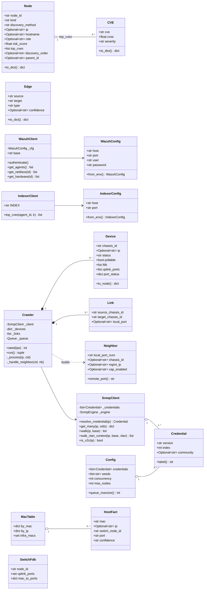
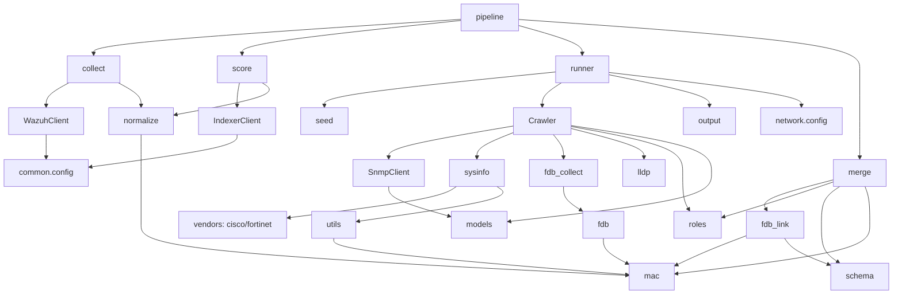
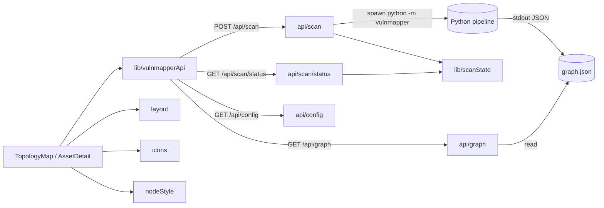
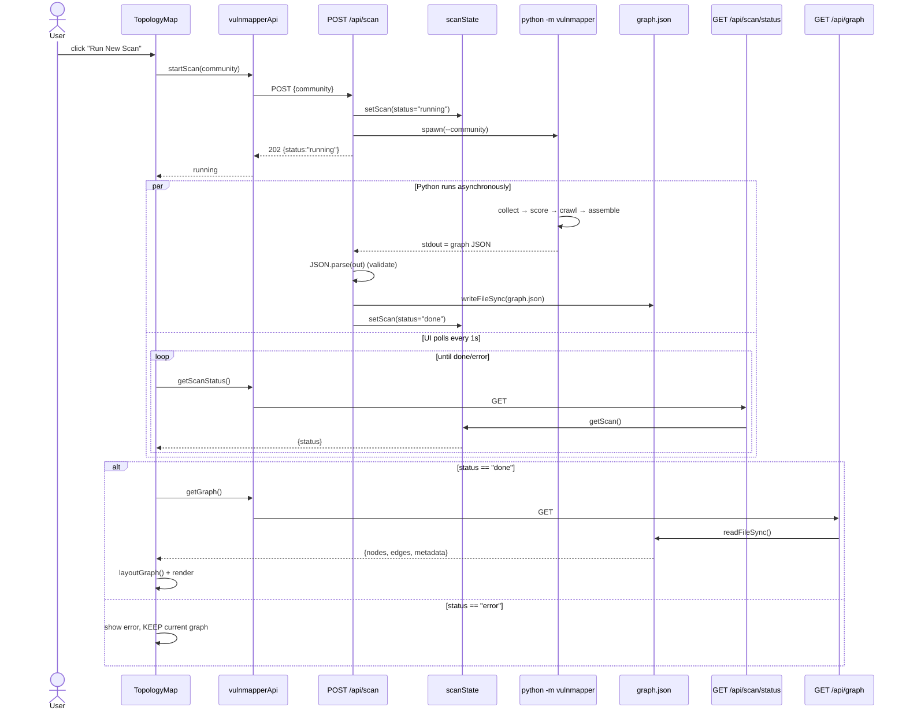
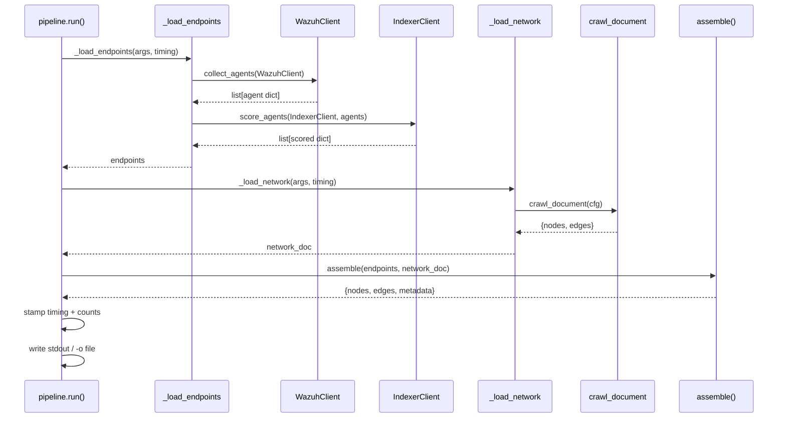
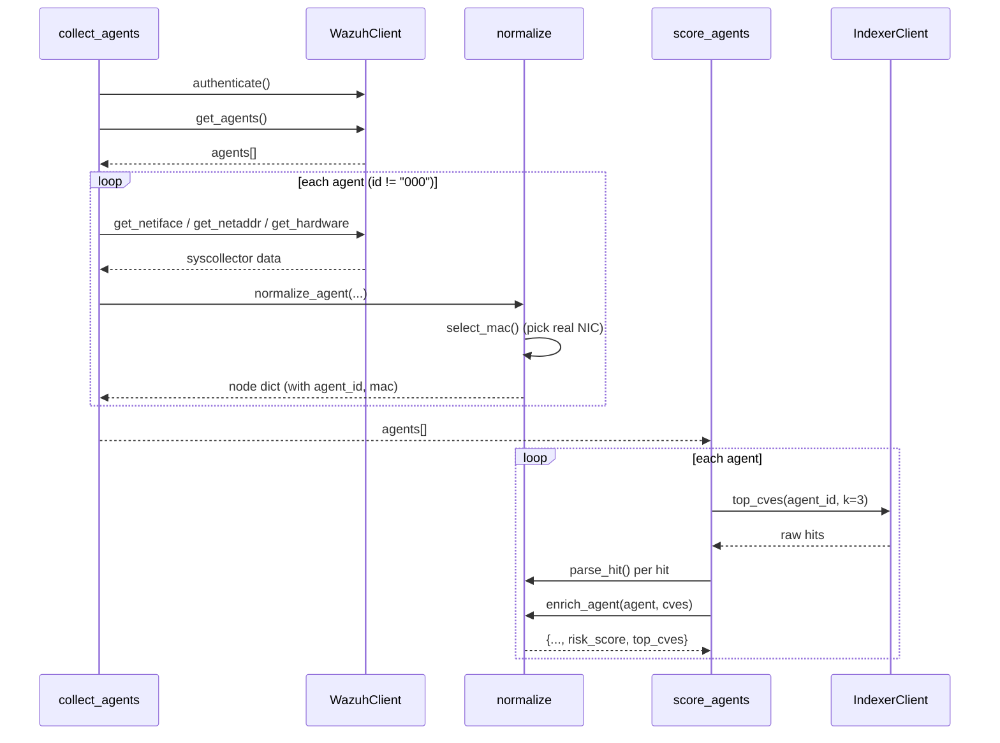
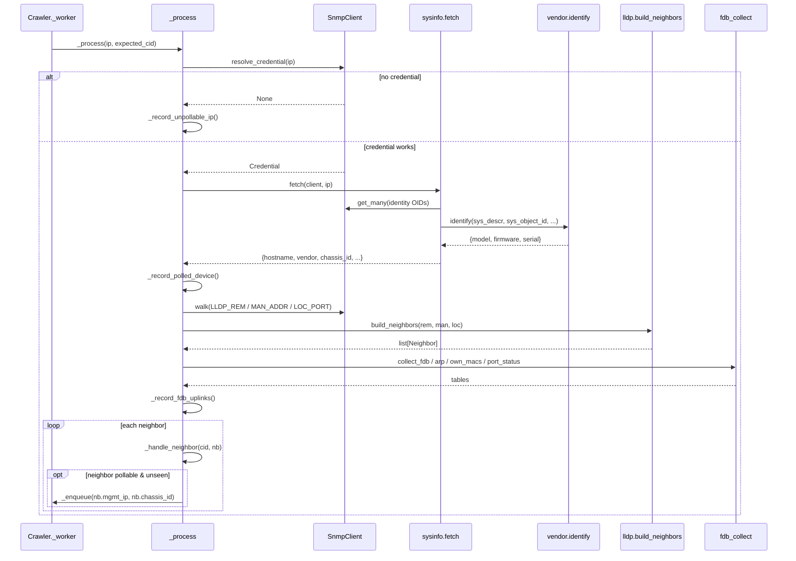
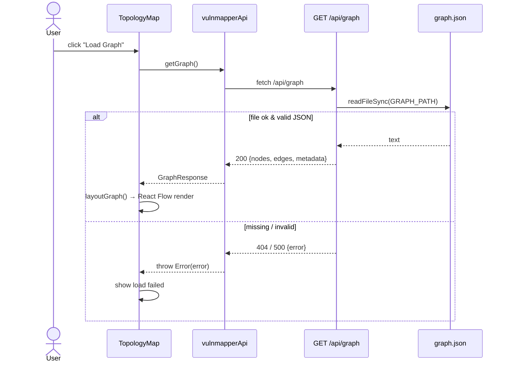

# Diagram Reference — Class, Object & Sequence

This document contains everything needed to draw **class diagrams**, **object
diagrams**, and **sequence diagrams** for the Wazuh Network Mapper. It pairs a
precise structured catalog (attributes, types, methods, relationships) with
ready-to-render **Mermaid** diagrams you can paste straight into any Mermaid
viewer (GitHub, mermaid.live, VS Code).

> **What each diagram needs (quick primer)**
>
> - **Class diagram** — the *types* in the system: each class/struct with its
>   **attributes** (name, type, visibility) and **methods** (signature, return
>   type), plus **relationships** between them: inheritance (`is-a`),
>   composition/aggregation (`has-a`, strong/weak ownership), association (a
>   reference), and dependency (uses/calls). Multiplicities (1, 0..1, *) say how
>   many of each. → Parts A, B, C.
> - **Object diagram** — a *snapshot* at one moment: specific **instances** of
>   those classes with **concrete attribute values**, and the **links** between
>   them. → Part D.
> - **Sequence diagram** — a *scenario* over time: the **participants**
>   (objects/components) as vertical lifelines, and the **messages** (calls)
>   exchanged between them in order, including loops, alternatives, and returns.
>   → Part E.
>
> **Note on Python "classes":** much of the backend is organized as *modules of
> functions* rather than classes (e.g. `pipeline`, `merge`, `lldp`, `fdb`,
> `roles`, `seed`). For diagramming, these are best modeled as **«module»**
> (utility/component) boxes whose "methods" are the module-level functions. The
> true classes are mostly `@dataclass` records plus a few service/engine classes.

---

## PART A — Python class catalog (the real backend)

Visibility convention: `+` public, `-` private (Python `_name`). `«dataclass»`
marks a data record; `«service»` marks an I/O/behavior class.

### A.1 Domain / schema records — `vulnmapper/common/schema.py`

**`CVE` «dataclass»** — one vulnerability finding on an endpoint.
| Attribute | Type | Default |
|---|---|---|
| `+cve` | `Optional[str]` | `None` |
| `+cvss` | `Optional[float]` | `None` |
| `+cvss_version` | `Optional[str]` | `None` |
| `+severity` | `Optional[str]` | `None` |
| `+package` | `Optional[str]` | `None` |
| `+version` | `Optional[str]` | `None` |
| `+description` | `Optional[str]` | `None` |

Methods: `+to_dict() -> dict`

**`Edge` «dataclass»** — a graph connection referencing nodes by `node_id`.
| Attribute | Type | Default |
|---|---|---|
| `+source` | `str` | — |
| `+target` | `str` | — |
| `+type` | `str` | — (`"lldp"` \| `"endpoint_link"`) |
| `+local_port` | `Optional[str]` | `None` |
| `+remote_port` | `Optional[str]` | `None` |
| `+confidence` | `Optional[str]` | `None` |

Methods: `+to_dict() -> dict`

**`Node` «dataclass»** — a unified graph node (endpoint *or* device); superset of
both worlds' fields.
| Attribute | Type | Default |
|---|---|---|
| `+node_id` | `str` | — |
| `+kind` | `str` | — (`"endpoint"` \| `"device"`) |
| `+discovery_method` | `str` | — |
| `+ip` | `Optional[str]` | `None` |
| `+hostname` | `Optional[str]` | `None` |
| `+vendor` | `Optional[str]` | `None` |
| `+model` | `Optional[str]` | `None` |
| `+firmware` | `Optional[str]` | `None` |
| `+serial` | `Optional[str]` | `None` |
| `+mac` | `Optional[str]` | `None` |
| `+status` | `Optional[str]` | `None` |
| `+role` | `Optional[str]` | `None` |
| `+agent_id` | `Optional[str]` | `None` |
| `+risk_score` | `float` | `0` |
| `+top_cves` | `list[CVE]` | `[]` |
| `+chassis_id` | `Optional[str]` | `None` |
| `+pollable` | `Optional[bool]` | `None` |
| `+neighbor_ports` | `Optional[list]` | `None` |
| `+uplink_ports` | `Optional[list]` | `None` |
| `+port_status` | `Optional[dict]` | `None` |
| `+fdb` | `Optional[list]` | `None` |
| `+discovery_order` | `Optional[int]` | `None` |
| `+parent_id` | `Optional[str]` | `None` |

Methods: `+to_dict() -> dict`
Relationship: `Node` "0..*" *aggregates* `CVE` (via `top_cves`).

Module-level helpers (model as «module» `schema`): `endpoint_node_id(agent_id)`,
`device_node_id(chassis_id)`, `host_node_id(mac)` → all `-> str`. Constants:
`KIND_ENDPOINT`, `KIND_DEVICE`, `DISCOVERY_WAZUH`, `DISCOVERY_SNMP_LLDP`,
`DISCOVERY_SNMP_FDB`, `EDGE_LLDP`, `EDGE_ENDPOINT_LINK`.

### A.2 Endpoint configuration — `vulnmapper/common/config.py`

**`WazuhConfig` «dataclass»**
| Attribute | Type | Default |
|---|---|---|
| `+host` | `str` | — |
| `+port` | `str` | — |
| `+user` | `str` | — |
| `+password` | `str` | — |
| `+verify` | `Union[bool, str]` | `False` |

Methods: `+from_env() -> WazuhConfig` «classmethod»

**`IndexerConfig` «dataclass»** — identical shape to `WazuhConfig`
(`host, port, user, password, verify`), `+from_env() -> IndexerConfig`.

Module helpers (`config`): `tls_verify(ca_bundle_env) -> bool|str`,
`_truthy(value) -> bool`.

### A.3 Endpoint I/O services — `vulnmapper/endpoints/`

**`WazuhClient` «service»** — `wazuh_client.py` (Wazuh Manager API fetch layer).
| Attribute | Type |
|---|---|
| `-_cfg` | `WazuhConfig` |
| `+base` | `str` |
| `+token` | `Optional[str]` |

Methods:
- `+__init__(config: WazuhConfig)`
- `+authenticate() -> None`
- `-_get(path: str, params: dict = None) -> list`
- `+get_agents() -> list[dict]`
- `+get_netiface(agent_id) -> list`
- `+get_netaddr(agent_id) -> list`
- `+get_hardware(agent_id) -> list`

Relationships: *association* to `WazuhConfig` (1); *dependency* on `requests`.

**`IndexerClient` «service»** — `indexer_client.py` (Wazuh Indexer fetch layer).
| Attribute | Type |
|---|---|
| `+INDEX` | `str` = `"wazuh-states-vulnerabilities-*"` (class const) |
| `+base` | `str` |
| `+auth` | `tuple[str, str]` |
| `+verify` | `Union[bool, str]` |

Methods:
- `+__init__(config: IndexerConfig)`
- `+top_cves(agent_id, k: int = 3) -> list[dict]`

Relationships: *association* to `IndexerConfig` (1); *dependency* on `requests`.

«module» **`collect`**: `collect_agents(client: WazuhClient) -> list[dict]`,
`main() -> int`. «module» **`score`**:
`score_agents(indexer: IndexerClient, agents: list[dict]) -> list[dict]`,
`main() -> int`. «module» **`normalize`** (pure): `is_locally_administered(mac)`,
`is_physical_iface(name, mac)`, `select_mac(netiface, netaddr, agent_ip)`,
`normalize_agent(agent, netiface, hardware, netaddr=None) -> dict`,
`parse_hit(hit) -> dict`, `enrich_agent(agent, top_cves) -> dict`.

### A.4 Network crawl records — `vulnmapper/network/models.py`

**`Credential` «dataclass»**
| Attribute | Type | Default |
|---|---|---|
| `+version` | `str` | — (`"v2c"`\|`"v3"`) |
| `+index` | `int` | `0` |
| `+community` | `Optional[str]` | `None` |
| `+user` | `Optional[str]` | `None` |
| `+auth_protocol` | `Optional[str]` | `None` |
| `+auth_key` | `Optional[str]` | `None` |
| `+priv_protocol` | `Optional[str]` | `None` |
| `+priv_key` | `Optional[str]` | `None` |

Methods: `+label` «property» `-> str`

**`Device` «dataclass»** — a discovered switch/router/firewall.
| Attribute | Type | Default |
|---|---|---|
| `+chassis_id` | `str` | — |
| `+ip` | `Optional[str]` | `None` |
| `+hostname` | `Optional[str]` | `None` |
| `+vendor` | `Optional[str]` | `None` |
| `+model` | `Optional[str]` | `None` |
| `+firmware` | `Optional[str]` | `None` |
| `+serial` | `Optional[str]` | `None` |
| `+mac` | `Optional[str]` | `None` |
| `+discovery_method` | `str` | `"snmp_lldp"` |
| `+status` | `str` | `"discovered"` |
| `+pollable` | `bool` | `False` |
| `+fdb` | `list[dict]` | `[]` |
| `+neighbor_ports` | `list` | `[]` |
| `+uplink_ports` | `list` | `[]` |
| `+port_status` | `dict` | `{}` |
| `+lldp_cap_enabled` | `Optional[str]` | `None` |
| `+arp` | `dict` | `{}` |
| `+own_macs` | `list` | `[]` |

Methods: `+to_node() -> dict`

**`Link` «dataclass, frozen»** — a directed LLDP adjacency.
| Attribute | Type | Default |
|---|---|---|
| `+source_chassis_id` | `str` | — |
| `+target_chassis_id` | `str` | — |
| `+local_port` | `Optional[str]` | `None` |
| `+remote_port` | `Optional[str]` | `None` |

Constants (`models`): `DISCOVERY_METHOD`, `STATUS_ONLINE`, `STATUS_UNREACHABLE`,
`STATUS_DISCOVERED`.

### A.5 LLDP parsing record — `vulnmapper/network/lldp.py`

**`Neighbor` «dataclass»** — one parsed LLDP neighbor.
| Attribute | Type | Default |
|---|---|---|
| `+local_port_num` | `str` | — |
| `+rem_index` | `str` | — |
| `+chassis_id` | `Optional[str]` | — |
| `+chassis_mac` | `Optional[str]` | — |
| `+port_id` | `Optional[str]` | — |
| `+port_descr` | `Optional[str]` | — |
| `+sys_name` | `Optional[str]` | — |
| `+sys_descr` | `Optional[str]` | — |
| `+mgmt_ip` | `Optional[str]` | — |
| `+local_port` | `Optional[str]` | — |
| `+cap_enabled` | `Optional[str]` | `None` |
| `+cap_supported` | `Optional[str]` | `None` |

Methods: `+remote_port` «property» `-> Optional[str]`

«module» **`lldp`** functions: `parse_loc_port_table(rows) -> dict`,
`parse_man_addr_table(rows) -> dict`, `parse_rem_table(rows) -> dict`,
`build_neighbors(rem_rows, man_addr_rows, loc_port_rows) -> list[Neighbor]`.

### A.6 SNMP engine — `vulnmapper/network/snmp_client.py`

**`SnmpClient` «service»**
| Attribute | Type |
|---|---|
| `-_credentials` | `list[Credential]` |
| `-_auth_by_cred` | `dict[int, Any]` |
| `-_port` | `int` |
| `-_timeout` | `float` |
| `-_retries` | `int` |
| `-_context` | `ContextData` |
| `-_engine` | `SnmpEngine` |
| `-_resolved` | `dict[str, Credential]` |

Methods (all `async` except `is_v2c`):
- `+__init__(credentials, *, port=161, timeout=1.0, retries=1)`
- `-_transport(ip) -> UdpTransportTarget`
- `-_get_with_auth(auth, ip, oids) -> Optional[dict]`
- `+resolve_credential(ip) -> Optional[Credential]`
- `+get_many(ip, oids) -> Optional[dict]`
- `+get(ip, oid) -> Optional[str]`
- `-_walk_with_auth(auth, ip, base_oid, *, max_repetitions=25) -> list[tuple]`
- `+walk(ip, base_oid, *, max_repetitions=25) -> list[tuple]`
- `+walk_vlan_context(ip, base_oid, vlan, *, max_repetitions=25) -> list[tuple]`
- `+is_v2c(ip) -> bool`

Relationships: *aggregates* `Credential` (1..*); *dependency* on pysnmp
(`SnmpEngine`, `CommunityData`, `UsmUserData`, …).

### A.7 The crawler — `vulnmapper/network/crawler.py`

**`Crawler` «service»** — owns shared crawl state + worker pool.
| Attribute | Type |
|---|---|
| `-_client` | `SnmpClient` |
| `-_concurrency` | `int` |
| `-_max_nodes` | `int` |
| `-_queue` | `asyncio.Queue` |
| `-_lock` | `asyncio.Lock` |
| `-_devices` | `dict[str, Device]` |
| `-_links` | `list[Link]` |
| `-_seen` | `set[str]` |
| `-_enqueued_ips` | `set[str]` |
| `-_reserved` | `int` |
| `-_caps` | `dict[str, str]` |

Methods (async unless noted):
- `+__init__(client, *, concurrency, max_nodes, queue_maxsize)`
- `-_cap_reached() -> bool` (sync)
- `-_enqueue(ip, chassis_id) -> bool`
- `+seed(ips: list[str]) -> int`
- `+run() -> tuple[list[Device], list[Link]]`
- `-_worker(worker_id: int) -> None`
- `-_process(ip, expected_cid) -> None`
- `-_walk_neighbors(ip) -> list[Neighbor]`
- `-_record_polled_device(ip, chassis_id, info) -> None`
- `-_record_fdb_uplinks(chassis_id, fdb_entries, neighbor_ports, uplink_ports, arp, own_macs, port_status) -> None`
- `-_record_unpollable_ip(ip, expected_cid) -> None`
- `-_handle_neighbor(source_cid, nb: Neighbor) -> None`

Relationships: *composition* `Crawler ◆── Device` (0..*) and
`Crawler ◆── Link` (0..*); *association* `Crawler ──> SnmpClient` (1);
*dependency* on `sysinfo`, `fdb_collect`, `lldp`, `roles`.

### A.8 Network config — `vulnmapper/network/config.py`

**`Config` «dataclass»**
| Attribute | Type | Default |
|---|---|---|
| `+credentials` | `list[Credential]` | — |
| `+seeds` | `list[str]` | — |
| `+concurrency` | `int` | `32` |
| `+timeout` | `float` | `1.0` |
| `+retries` | `int` | `1` |
| `+max_nodes` | `int` | `5000` |
| `+port` | `int` | `161` |
| `+pollable_only` | `bool` | `False` |
| `+output_path` | `Optional[str]` | `None` |

Methods: `+queue_maxsize` «property» `-> int`
Module helpers: `load_credentials(cli_communities) -> list[Credential]`,
`add_v3_credential(...) -> None`, `_split(raw) -> list[str]`.

### A.9 FDB linking records — `vulnmapper/linking/fdb_link.py`

**`SwitchFdb` «dataclass»**: `+node_id:str`, `+chassis_id:str`,
`+ip:Optional[str]`, `+uplink_ports:set`, `+mac_to_ports:dict`,
`+port_mac_count:dict`.

**`HostFact` «dataclass»**: `+mac:str`, `+ip:Optional[str]`,
`+switch_node_id:str`, `+port:str`, `+vlan:Optional[int]`, `+confidence:str`.

**`MacTable` «dataclass»**: `+by_mac:dict[str,HostFact]`,
`+by_ip:dict[str,str]`, `+infra_macs:set`.
Relationship: `MacTable` "1" *aggregates* `HostFact` "0..*".

«module» **`fdb_link`** functions: `index_switches(network_nodes) -> list[SwitchFdb]`,
`_infra_macs(network_nodes) -> set`, `build_mac_table(network_nodes) -> MacTable`,
`same_subnet(ip_a, ip_b, prefix=24) -> bool`. Constants: `CONF_LLDP`,
`CONF_RESOLVED`, `CONF_TIEBREAK`, `CONF_SUBNET_FALLBACK`, `CONF_FDB`,
`REASON_NO_MAC`, `REASON_ABSENT`, `REASON_OFFLINE`.

### A.10 Procedural modules (model as «module» boxes)

| «module» | Key functions (signature → return) |
|---|---|
| `pipeline` | `build_parser()→ArgumentParser`; `_load_endpoints(args, timing)→list[dict]`; `_load_network(args, timing)→dict`; `run(argv=None)→int` |
| `assemble.merge` | `_device_node(raw)→Node`; `_endpoint_node(raw)→Node`; `_lldp_switch_and_port(phantom_chassis, raw_edges)→(str,str)`; `_subnet_parent(ip, device_nodes)→Optional[str]`; `_bfs_device_order(device_ids, lldp_edges)→(list,dict)`; `assemble(endpoints, network_doc)→dict` |
| `network.runner` | `run(cfg: Config)→dict` (async); `crawl_document(cfg)→dict` |
| `network.seed` | `default_gateways()→list[str]`; `local_lldp_neighbors()→list[str]`; `discover_seeds(explicit=None)→list[str]` |
| `network.sysinfo` | `enterprise_number(sys_object_id)→Optional[str]`; `vendor_from_descr(sys_descr)→Optional[str]`; `fetch(snmp_client, ip)→Optional[dict]` (async) |
| `network.roles` | `decode_capabilities(raw)→set[str]`; `role_from_capabilities(caps)→Optional[str]`; `derive_role(*, capabilities, vendor, model, mac, kind)→str`; `neighbor_is_infrastructure(mgmt_ip, capabilities)→bool` |
| `network.fdb` | `parse_dot1q_fdb`, `parse_dot1d_fdb`, `parse_arp`, `parse_own_macs`, `parse_oper_status`, `build_port_status`, `parse_vtp_vlans`, `build_fdb(...)`, `resolve_port(...)` (all pure parsers) |
| `network.fdb_collect` | `collect_fdb(client, ip)→list[dict]`; `collect_arp(client, ip)→dict`; `collect_own_macs(client, ip)→list`; `collect_port_status(client, ip)→dict` (all async) |
| `network.output` | `_dedupe_edges(links)→list[dict]`; `build_document(devices, links, *, pollable_only=False)→dict`; `emit(document)`; `write(document, path)` |
| `network.vendors.cisco` | `identify(sys_descr, sys_object_id, snmp_client, ip)→dict` (async) |
| `network.vendors.fortinet` | `identify(...)→dict` (async); `_model_from_object_id`; `_parse_firmware` |
| `common.mac` | `canonical_mac(value)→Optional[str]`; `format_mac(value)→Optional[str]`; `normalize_mac` (= `format_mac`) |
| `network.utils` | `normalize_chassis_id(value)→Optional[str]`; `collapse_whitespace(value)→Optional[str]` |

---

## PART B — TypeScript class/type catalog (web app)

TypeScript types are mostly **interfaces/type aliases** (model as classes with
attributes only) and **module functions** (model as «module» operations).

### B.1 Scan state — `lib/scanState.ts`

**`ScanState` «type»**: `+status: ScanStatus` (`"idle"|"running"|"done"|"error"`),
`+error: string|null`, `+startedAt: string|null`, `+finishedAt: string|null`.
«module» functions: `getScan() -> ScanState`, `setScan(next: ScanState) -> void`,
plus a module-level singleton `scan: ScanState`.

### B.2 Graph client + types — `lib/vulnmapperApi.ts`

| «type» | Fields |
|---|---|
| `CVE` | `cve, severity, cvss(number\|null), cvss_version, package, version, description` |
| `GraphNodeBase` | `node_id, kind("device"\|"endpoint"), ip, hostname, vendor, model, firmware, serial, mac, discovery_method, status, risk_score(number\|null), discovery_order, parent_id, role` |
| `DeviceNode` | `GraphNodeBase & { kind:"device", chassis_id?, pollable?, uplink_ports?, neighbor_ports?, port_status?, port_status_note? }` |
| `EndpointNode` | `GraphNodeBase & { kind:"endpoint", agent_id, top_cves: CVE[] }` |
| `GraphNode` | `DeviceNode \| EndpointNode` (union) |
| `GraphEdge` | `source, target, type("lldp"\|"endpoint_link"), local_port?, remote_port?, source_name?, target_name?, confidence?` |
| `Metadata` | `scan_time?, network_scan_time?, seed?, counts?{...}, [key]: unknown` |
| `GraphResponse` | `{ nodes: GraphNode[], edges: GraphEdge[], metadata: Metadata }` |
| `ScanStatusResponse` | `{ status, error, startedAt, finishedAt }` |

Inheritance: `DeviceNode` and `EndpointNode` *extend* `GraphNodeBase`;
`GraphNode` is their *union*. Composition: `EndpointNode` "1" *has* `CVE` "0..*";
`GraphResponse` *has* `GraphNode[]` + `GraphEdge[]` + `Metadata`.
«module» functions: `getConfig()`, `getGraph()→Promise<GraphResponse>`,
`startScan(community)`, `getScanStatus()→Promise<ScanStatusResponse>`, `asJson<T>()`.

### B.3 API routes — `app/api/**/route.ts` (model as «component» endpoints)

- `graph/route.ts`: `GET() -> NextResponse` (reads `graph.json`).
- `scan/route.ts`: `POST(req) -> NextResponse` (spawns Python, writes file).
- `scan/status/route.ts`: `GET() -> NextResponse` (returns `getScan()`).
- `config/route.ts`: `GET() -> NextResponse` (`{ community }`).

### B.4 Risk module — `risk-module/`

| «type» / «module» | Contents |
|---|---|
| `Asset` | `id, hostname, os, exposure, criticality, segment` |
| `Vulnerability` | `id, assetId, cveId, cvss, title` |
| `TopologyDefinition` | `nodes:{id,label}[], edges:{source,target}[]` |
| `AssetWithRisk` | `Asset & { aggregatedRisk:number, topVulnerabilities:Vulnerability[] }` |
| `DashboardSummary` | `overallRisk, highRiskAssetCount, internetFacingCritical, lateralMovementRisk` |
| «module» `dataLoader` | `getAssets()`, `getVulnerabilities()`, `getTopology()` |
| «module» `aggregation` | `aggregateTopVulnerabilities(scores, topN=3)→number` |
| «module» `exposureMultiplier` | `getExposureMultiplier(exposure)→number` |
| «module» `assetCriticality` | `getCriticalityWeight(criticality)→number` |
| «module» `riskService` | `getDashboardSummary`, `getAssetsWithRisk`, `getAssetDetail`, `getExecutiveReport`, `getRecentAlerts`, `getVulnerabilityReport`, `getAttackPathAnalysis`, `getRecommendations`, `getNetworkLegend`, `getScanConfigDefaults` |
| «module» `layout` (UI) | `layoutGraph(nodes, edges)→PositionedNode[]` |
| «module» `icons` (UI) | `iconForRole(role)→LucideIcon` |
| «module» `nodeStyle` (UI) | `riskColor(score)→string`, `riskLabel(score)→string`, `isOffline(status)→bool` |

---

## PART C — Relationships (for the class diagram)

### C.1 Mermaid class diagram — backend core



### C.2 Module dependency map (who uses whom)



### C.3 Web ↔ backend boundary



---

## PART D — Object diagrams (concrete snapshots)

Real instances drawn from the sample `graph.json` (after a completed scan).

### D.1 A populated graph snapshot (UML object diagram)

```mermaid
classDiagram
    direction TB

    class l3switch["l3sw : Node"]
    l3switch : node_id = "device:00:23:ac:e5:74:00"
    l3switch : kind = "device"
    l3switch : hostname = "L3-Switch"
    l3switch : ip = "172.20.40.254"
    l3switch : vendor = "Cisco"
    l3switch : model = "C3750"
    l3switch : role = "l3-switch"
    l3switch : status = "online"
    l3switch : risk_score = 0
    l3switch : parent_id = null
    l3switch : discovery_order = 0

    class firewall["fw : Node"]
    firewall : node_id = "device:90:6c:ac:d7:43:7f"
    firewall : kind = "device"
    firewall : hostname = "CYFOR-Firewall.cyfor.lab"
    firewall : ip = "172.20.100.1"
    firewall : vendor = "Fortinet"
    firewall : model = "FortiGate 200D"
    firewall : firmware = "6.0.16"
    firewall : status = "online"

    class fdbhost["host1 : Node"]
    fdbhost : node_id = "host:d4:be:d9:97:f4:ca"
    fdbhost : kind = "endpoint"
    fdbhost : mac = "d4:be:d9:97:f4:ca"
    fdbhost : ip = "172.20.40.1"
    fdbhost : discovery_method = "snmp_fdb"
    fdbhost : status = "discovered"
    fdbhost : risk_score = null
    fdbhost : role = "host"
    fdbhost : parent_id = "device:00:23:ac:e5:74:00"

    class linkEdge["e1 : Edge"]
    linkEdge : source = "host:d4:be:d9:97:f4:ca"
    linkEdge : target = "device:00:23:ac:e5:74:00"
    linkEdge : type = "endpoint_link"
    linkEdge : confidence = "fdb"

    l3switch <-- fdbhost : parent_id
    fdbhost --> l3switch : e1 (endpoint_link)
```

### D.2 Crawl-time runtime snapshot (mid-scan object diagram)

A moment during the live crawl, after the seed switch is polled and one neighbor
is queued:

```mermaid
classDiagram
    class crawler["crawler : Crawler"]
    crawler : _concurrency = 32
    crawler : _max_nodes = 5000
    crawler : _reserved = 2
    crawler : _seen = {"00:23:ac:e5:74:00", "90:6c:ac:d7:43:7f"}

    class snmp["client : SnmpClient"]
    snmp : _port = 161
    snmp : _timeout = 1.0
    snmp : _retries = 1
    snmp : _resolved = {"172.20.40.254": cred_v2c}

    class cred["cred_v2c : Credential"]
    cred : version = "v2c"
    cred : index = 1
    cred : community = "<community>"

    class dev1["dev_l3 : Device"]
    dev1 : chassis_id = "00:23:ac:e5:74:00"
    dev1 : ip = "172.20.40.254"
    dev1 : status = "online"
    dev1 : pollable = true

    class nb["nb_fw : Neighbor"]
    nb : chassis_id = "90:6c:ac:d7:43:7f"
    nb : mgmt_ip = "172.20.100.1"
    nb : local_port = "Fa1/0/1"

    crawler --> snmp : _client
    snmp --> cred : resolved["172.20.40.254"]
    crawler --> dev1 : _devices[chassis]
    crawler ..> nb : processing
```

> To build other object snapshots, instantiate any `Node`/`Device`/`Edge` from
> Part A with concrete values from `graph.json`, and draw a `parent_id` link from
> each child node to its parent and an `Edge` instance per connection.

---

## PART E — Sequence diagrams (scenarios)

### E.1 End-to-end: user triggers a new scan

Participants: **User**, **TopologyMap (UI)**, **vulnmapperApi (client)**,
**/api/scan**, **/api/scan/status**, **scanState**, **Python pipeline**,
**graph.json**, **/api/graph**.



### E.2 Backend pipeline internals (the `run()` orchestration)



### E.3 Endpoint collection + scoring



### E.4 The BFS crawl — one device processed by a worker



### E.5 The merge — parenting one endpoint (three-tier ladder)

```mermaid
sequenceDiagram
    participant A as assemble()
    participant ML as build_mac_table
    participant MT as MacTable
    participant SP as _subnet_parent

    A->>ML: build_mac_table(raw_nodes)
    ML-->>A: MacTable (by_mac, by_ip, infra_macs)

    note over A: Tier 1 — LLDP phantom merge
    A->>A: chassis_id == endpoint.mac?
    alt match
        A->>A: parent = switch, confidence="lldp"; delete phantom
    else no LLDP match
        note over A: Tier 2 — FDB lookup
        A->>MT: by_mac[endpoint.mac]
        alt MAC found
            MT-->>A: HostFact(switch, port, confidence)
            A->>A: parent = HostFact.switch_node_id
        else no MAC but IP known
            A->>MT: by_ip[endpoint.ip]
            MT-->>A: mac → HostFact (back-fill mac)
        else absent
            note over A: Tier 3 — subnet fallback
            A->>SP: _subnet_parent(ip, device_nodes)
            alt subnet match
                SP-->>A: device_id (confidence="subnet_fallback")
            else
                A->>A: leave unparented + record reason
            end
        end
    end
```

### E.6 Serving the graph (GET /api/graph)



---

## PART F — Cheat sheet: what to draw for each diagram

- **Class diagram (structure):** Use Parts A & B for boxes (attributes +
  methods) and Part C for the arrows. The "true" classes worth boxing:
  `Node`, `Edge`, `CVE`, `WazuhClient`, `IndexerClient`, `WazuhConfig`,
  `IndexerConfig`, `Credential`, `Device`, `Link`, `Neighbor`, `SnmpClient`,
  `Crawler`, `Config`, `SwitchFdb`, `HostFact`, `MacTable` (Python); the
  `Graph*` types + `ScanState` (TypeScript). Render procedural files as
  «module» boxes whose operations are the listed functions.
- **Object diagram (snapshot):** Use Part D. Pick a moment (finished graph, or
  mid-crawl) and instantiate the relevant classes with the concrete values
  shown, drawing `parent_id` and `Edge` links between instances.
- **Sequence diagram (behavior):** Use Part E. The six scenarios cover the
  whole system: full scan trigger (E.1), pipeline orchestration (E.2), endpoint
  collect+score (E.3), one crawl step (E.4), the parenting merge (E.5), and
  serving the graph (E.6). Each lists its participants (lifelines) and ordered
  messages, with the `alt`/`loop`/`par` fragments already marked.
