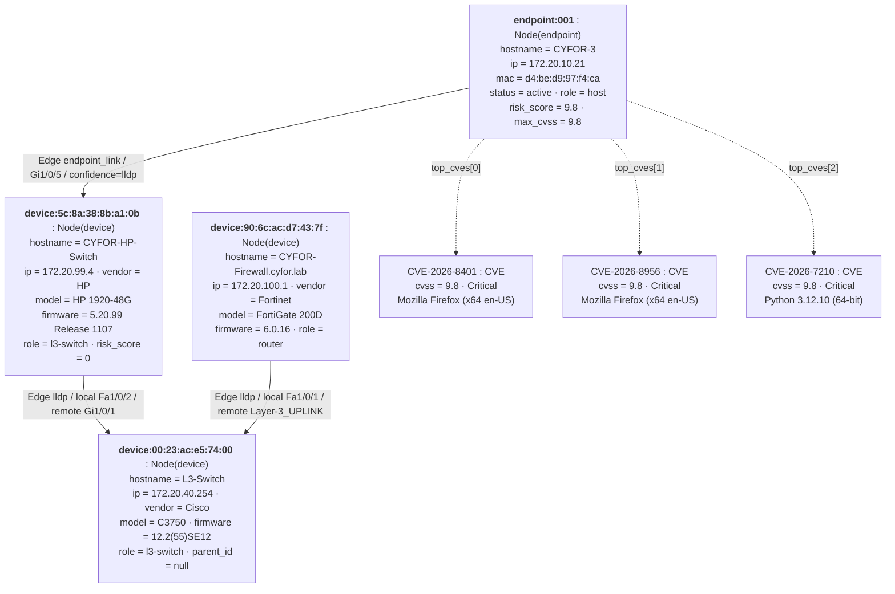

# Object diagram — one assembled-graph snapshot

A single snapshot in time from the real `graph.json` (scan of 2026-06-13): the
attack-path slice from the most-critical live endpoint up to the network edge.
Every value below is copied verbatim from the assembled document. These are
**assembled-graph objects only** (`Node` / `Edge` / `CVE`) — no collector-stage
objects (`Device` / `Link` / `Neighbor`), so it is a coherent single snapshot of
one pipeline stage.

## Exact field values (verbatim from `graph.json`)

| Object | node_id | key fields |
|---|---|---|
| `Node` endpoint | `endpoint:001` | hostname=CYFOR-3, ip=172.20.10.21, mac=d4:be:d9:97:f4:ca, status=active, role=host, risk_score=9.8, max_cvss=9.8, parent_id=device:5c:8a:38:8b:a1:0b |
| `Node` device | `device:5c:8a:38:8b:a1:0b` | hostname=CYFOR-HP-Switch, ip=172.20.99.4, vendor=HP, model=HP 1920-48G, firmware=5.20.99 Release 1107, role=l3-switch, risk_score=0 |
| `Node` device | `device:00:23:ac:e5:74:00` | hostname=L3-Switch, ip=172.20.40.254, vendor=Cisco, model=C3750, firmware=12.2(55)SE12, role=l3-switch, parent_id=null |
| `Node` device | `device:90:6c:ac:d7:43:7f` | hostname=CYFOR-Firewall.cyfor.lab, ip=172.20.100.1, vendor=Fortinet, model=FortiGate 200D, firmware=6.0.16, role=router |
| `Edge` | endpoint:001 → device:5c:8a:38:8b:a1:0b | type=endpoint_link, local_port=GigabitEthernet1/0/5, confidence=lldp |
| `Edge` | device:00:23:ac:e5:74:00 → device:5c:8a:38:8b:a1:0b | type=lldp, local_port=Fa1/0/2, remote_port=GigabitEthernet1/0/1 |
| `Edge` | device:00:23:ac:e5:74:00 → device:90:6c:ac:d7:43:7f | type=lldp, local_port=Fa1/0/1, remote_port=Layer-3_UPLINK |
| `CVE` ×3 on endpoint:001 | — | CVE-2026-8401 / CVE-2026-8956 / CVE-2026-7210, all cvss 9.8, Critical |

**Reading the slice:** the critical host `CYFOR-3` (`endpoint:001`, risk 9.8) hangs
off the HP access switch on `GigabitEthernet1/0/5` (LLDP-confidence), which uplinks
to the Cisco `L3-Switch` core, which also fronts the `FortiGate` firewall — the
path an attacker on CYFOR-3 would traverse toward the network edge.
